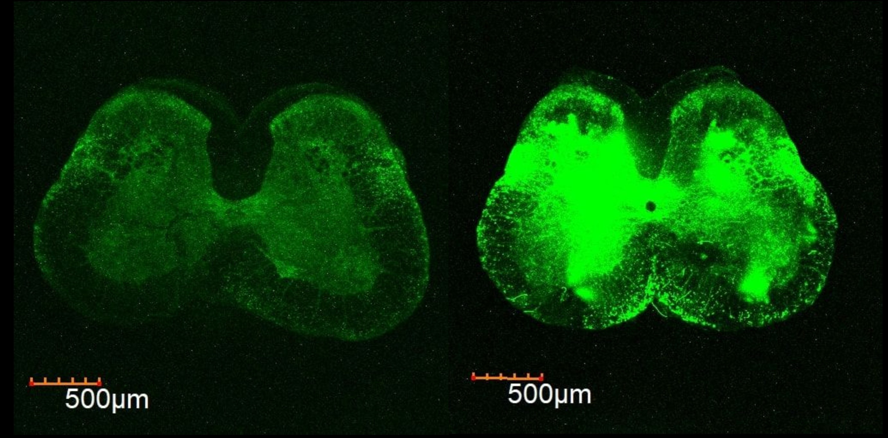
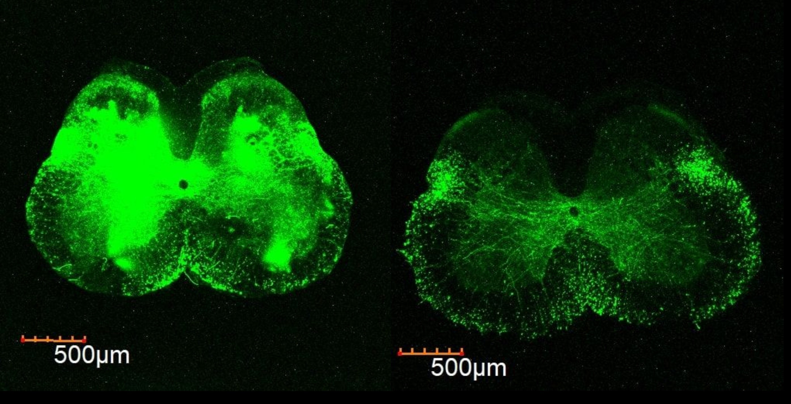
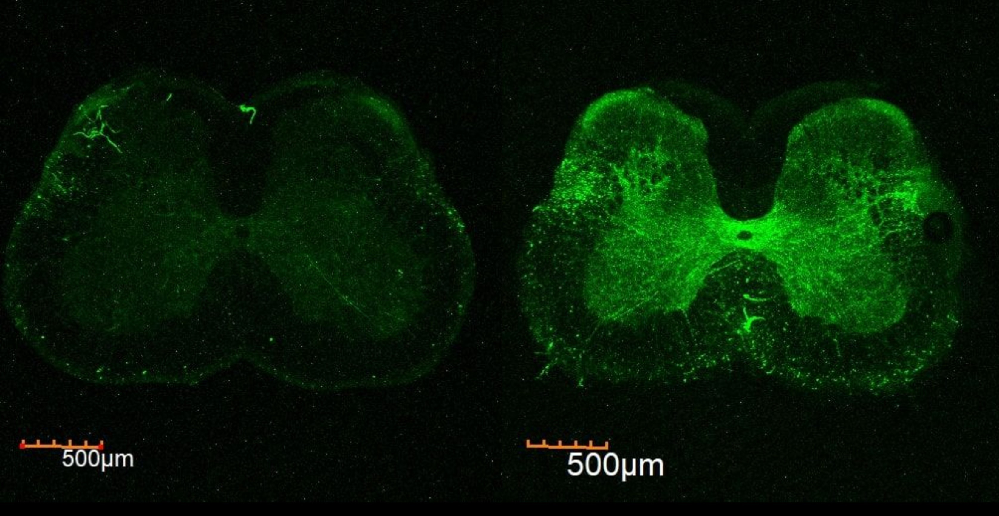

<script type="text/javascript">
 function showhide(id) {
    var e = document.getElementById(id);
    e.style.display = (e.style.display == 'block') ? 'none' : 'block';
 }
 
 function openTab(evt, tabName) {
    var i, tabcontent, tablinks;
    tabcontent = document.getElementsByClassName("tabcontent");
    for (i = 0; i < tabcontent.length; i++) {
        tabcontent[i].style.display = "none";
    }
    tablinks = document.getElementsByClassName("tablinks");
    for (i = 0; i < tablinks.length; i++) {
        tablinks[i].className = tablinks[i].className.replace(" active", "");
    }
    document.getElementById(tabName).style.display = "block";
    evt.currentTarget.className += " active";
 }
</script>


```{r, message=FALSE, warning=FALSE, include=FALSE}
# Load your libraries
library(car)
library(tidyverse)
library(mosaic)
library(DT)
library(pander)
library(plotly)
library(reshape2)
library(RColorBrewer)

```

```{r}

RData<-read.csv("AAV9 - RData.csv", header=TRUE,stringsAsFactors = TRUE)

myaov <- aov(Intensity ~ days + Region+days:Region+sex+sex:days+volume.nl., data=RData)
```


## Background {.tabset .tabset-fade}

### Overview


AAV9-GFP (the adeno-associated viral vector carrying a gene for green fluorescent protein) is widely known for not only being an excellent carrier for gene therapy but also for its wide use in neuronal tract tracing[^1]. However, there are certain difficulties scientists face when using this type of vector. For example, there is no explicit information available explaining how the intensity of such a marker changes over time. This might be a problem when deciding how long to wait, how much to inject, or if the gender or weight of animal matters. The data was taken from a study performed on mice using AAV9-GFP for neuronal tract-tracing of the RVM region of the brain to answer those questions. (click "Experimental Details" tab for more information on the study performed)

### Experimental Details

The AVV9-GFP was stereotaxically injected into the RVM region of the brains of 8 adult male and 8 adult female mice (n = 16). Mice were injected with different volumes of the viral vectors (50nl, 100nl, or 150nl randomly) and also had different timelines of the injection and the sacrifice of an animal: 36, 37, 43, 48, 51 days or 5.1, 5.3, 6.1, 6.9, 7.3 weeks respectively. 

The brains and the spinal cords of those mice were extracted and analyzed under the same settings using the Olympus FluoView Microscope in LI (Lamina 1), LX (Lamina 10), DLF (Dorso-lateral funiculus) regions of the spinal cord where GFP expression was observed. Average intensity values in each of those regions were recorded. (click "The Data" tab to see the data that was recorded)


### The Data 


* 'fileName': the name of the file where the data was taken from.

* 'mouse': number of a mouse that was injected.

* 'sex': sex of a mouse.

* 'volume.nl.': the volume of AAV9-GFP that was injected into the RVM region of a mouse.

* 'days': days passed since the injection day.

* 'weeks': weeks passed since the injection day.

* 'weight.g.': the weight of a mouse in grams.

* 'Intensity': the intensity of an image.

* 'Region': region in which the expression was analyzed.


```{r}
pander(RData, split.table=Inf)
```


## Analysis


#### Hypotheses

<div style="font-size:0.9em;color:darkgray;">"Note: A factor is defined as a qualitative variable containing at least two categories. The categories of the factor are referred to as the “levels” of the factor." ([Garrett Saunders](https://www.linkedin.com/in/garrett-saunders-337754123)) </div>

\r\n

Since we are interested in knowing how the intensity (quantitative variable) of the dye changes depending on different factors (qualitative variables), we will need to use a multi-way ANOVA to see which factors are significant and how they affect the intensity. For this analysis, I will use a four-way ANOVA with the factors of `days`, `Region`, `sex`, `volume.nl.` and `days:Region`, `days:sex` interactions. To simplify the model, I did not include any other terms (factors or interactions) that were insignificant here. Thus, we have six sets of hypotheses that need to be stated in order to understand the effect of each on the average value of `Intensity`.


Applying a four-way ANOVA with the interaction terms to this study, we have the model for the Intensity given by

$$
  \underbrace{Y_{ijklm}}_\text{Intensity} = \mu + \alpha_i + \beta_j +\gamma_k+\delta_l+ \alpha\beta_{ij}+\alpha\gamma_{ik} + \epsilon_{ijklm}
$$

where $\mu$ is the grand mean <div style="font-size:0.9em;">([The grand mean is the mean of the means of several subsamples, as long as the subsamples have the same number of data points.](https://en.wikipedia.org/wiki/Grand_mean)),</div>

$\alpha_i$ is the `days` factor with levels $1 = 36$, $2 = 37$, $3 = 43$, $4 = 48$, and $5 = 51$,

$\beta_j$ is the `Region` factor with levels $1 = LX$, $2 = LI$, and $3 = DLF$,

$\gamma_k$ is the `sex` factor with levels $1 = F$, $2 = M$,

$\delta_l$ is the `volume.nl.` factor with levels $1 = 50$, $2 = 100$, and $3 = 150$,

$\alpha\beta_{ij}$ is the interaction of the two `days` and `Region` factors which has $5\times3=15$ levels,

$\alpha\gamma_{ik}$ is the interaction of the two `days` and `sex` factors which has $5\times2=10$ levels,

$\epsilon_{ijklm} \sim N(0,\sigma^2)$ is the normally distributed error term. 


This model allows us to ask the following questions and hypotheses.

1. Does the number of `days` affect the average value of Intensity?

Factor: `days` with levels $36$, $37$, $43$, $48$, and $51$.

$$
  H_0: \alpha_{36} = \alpha_{37} = \alpha_{43}= \alpha_{48}= \alpha_{51}= 0
$$


$$
  H_a: \alpha_i \neq 0 \ \text{for at least one}\ i\in\{1 = 36, 2 = 37, 3 = 43, 4 = 48, 5 = 51\}
$$


2. Does the `Region` affect the average value of Intensity?

Factor: `Region` with levels $LX$, $LI$, and $DLF$.
$$
  H_0: \beta_{LX} = \beta_{LI} = \beta_{DLF} = 0
$$
$$
  H_a: \beta_j \neq 0 \ \text{for at least one}\ j\in\{1=LX,2=LI,3=DLF\}
$$

3. Does `sex` affect the average value of Intensity?

Factor: `sex` with levels $F$, and $M$.

$$
  H_0: \gamma_F = \gamma_M = 0
$$


$$
  H_a: \gamma_k \neq 0 \ \text{for at least one}\ k\in\{1=F,2=M\}
$$


4. Does `volume.nl.` affect the average value of Intensity?

Factor: `volume.nl.` with levels $50$, $100$, and $150$.

$$
  H_0: \delta_{50} = \delta_{100} = \delta_{150} = 0
$$


$$
  H_a: \delta_l \neq 0 \ \text{for at least one}\ l\in\{1=50, 2=100, 3 = 150\}
$$


5. Does the effect of `days` change for different `Region`s in the spinal cord? (Does the effect of `days` change for different levels of `Region`?) In other words, is there an interaction between `days` and `Region`?

$$
  H_0: \alpha\beta_{ij} = 0 \ \text{for all } i,j
$$
$$
  H_a: \alpha\beta_{ij} \neq 0 \ \text{for at least one } i,j
$$

6. Does the effect of `days` change for different `sex`es? (Does the effect of `days` change for different levels of `sex`?) In other words, is there an interaction between `days` and `sex`?

$$
  H_0: \alpha\gamma_{ik} = 0 \ \text{for all } i,k
$$
$$
  H_a: \alpha\gamma_{ik} \neq 0 \ \text{for at least one } i,k
$$


A significance level of $\alpha = 0.05$ will be used for this study.


<a href="javascript:showhide('qqplotb')">Show the diagnostic plots<span style="font-size:8pt;">(click to view)</span></a>

<div id="qqplotb" style="display:none;">


Before performing the Four-way ANOVA test, let’s first see if the requirements for this test are satisfied:

```{r}    
par(mfrow = c(1,2))

plot(myaov, which = 1)
qqPlot(myaov$residuals, id=FALSE, main = "Normal Q-Q", ylab = "Stansardized residuals", xlab = "Theoretical Quantiles")
```


The requirements are not satisfied (in the 'Residuals vs Fitted' plot the vertical spread of dots is not roughly the same across all x values and in the 'Normal Q-Q' plot the data points are coming outside of the boundaries of the dashed lines), so we will have to use Permutation Test (which allows for any test whether the data is parametric or not). Here are the results that we get:


```{r}

# The initial test is done in the same way as one-way ANOVA but there is a little more to find the test statistic

myTest <- aov(Intensity ~ days + Region+days:Region+sex+sex:days+volume.nl., data=RData)

# This first test statistic is the comparison between 5 different days
observedTestStatW <- summary(myTest)[[1]]$`F value`[1]

# This second test statistic is the comparison between the three different Regions
observedTestStatR <- summary(myTest)[[1]]$`F value`[2]

# The third test statistic is the comparison between the two different sexes
observedTestStatS <- summary(myTest)[[1]]$`F value`[3]

# The third test statistic is the comparison between the three different volumes
observedTestStatV <- summary(myTest)[[1]]$`F value`[4]

# The third test statistic is the comparison of the interaction of days and Region
observedTestStatWR <- summary(myTest)[[1]]$`F value`[5]

# The third test statistic is the comparison of the interaction of days and sex
observedTestStatWS <- summary(myTest)[[1]]$`F value`[6]

# Now comes six different permutations for the test. First is for days, second is for Regions, and third is for sex, fourth is for volumes, fifth for the interaction between days and Regions, and sixth for the interaction between days and sex

N <- 2000

permutedTestStatsW <- rep(NA, N)
permutedTestStatsR <- rep(NA, N)
permutedTestStatsS <- rep(NA, N)
permutedTestStatsV <- rep(NA, N)
permutedTestStatsWR <- rep(NA, N)
permutedTestStatsWS <- rep(NA, N)

for (i in 1:N){
  permuteData <- sample(RData$Intensity)
  permutedTest <- aov(permuteData ~ days + Region+days:Region+sex+sex:days+volume.nl., data=RData)
  permutedTestStatsW[i] <- summary(permutedTest)[[1]]$`F value`[1]
  permutedTestStatsR[i] <- summary(permutedTest)[[1]]$`F value`[2]
  permutedTestStatsS[i] <- summary(permutedTest)[[1]]$`F value`[3]
  permutedTestStatsV[i] <- summary(permutedTest)[[1]]$`F value`[4]
  permutedTestStatsWR[i] <- summary(permutedTest)[[1]]$`F value`[5]
  permutedTestStatsWS[i] <- summary(permutedTest)[[1]]$`F value`[6]
}

# We likewise need six differenct plots to show the distribution. First is for days, second is for Regions, and third is for sex, fourth is for volumes, fifth for the interaction between days and Regions, and sixth for the interaction between days and sex


hist(permutedTestStatsW, col = "skyblue", xlim = c(0,16))
abline(v = observedTestStatW, col = "red", lwd = 3)

hist(permutedTestStatsR, col = "skyblue")
abline(v = observedTestStatR, col = "red", lwd = 3)

hist(permutedTestStatsS, col = "skyblue")
abline(v = observedTestStatS, col = "red", lwd = 3)

hist(permutedTestStatsV, col = "skyblue")
abline(v = observedTestStatV, col = "red", lwd = 3)

hist(permutedTestStatsWR, col = "skyblue")
abline(v = observedTestStatWR, col = "red", lwd = 3)

hist(permutedTestStatsWS, col = "skyblue")
abline(v = observedTestStatWS, col = "red", lwd = 3)

# Here is the greater-than p-value (since the F-distribution is right skewed
# this is the only p-value of interest.)

#sum(permutedTestStatsW >= observedTestStatW)/N

#sum(permutedTestStatsR >= observedTestStatR)/N

#sum(permutedTestStatsS >= observedTestStatS)/N

#sum(permutedTestStatsV >= observedTestStatV)/N

#sum(permutedTestStatsWR >= observedTestStatWR)/N

#sum(permutedTestStatsWS >= observedTestStatWS)/N

```


</div>


```{r, include = FALSE}
myaov <- aov(Intensity ~ days + Region+days:Region+sex+sex:days+volume.nl., data=RData)
summary(myaov) %>% pander()
```


----------------------------------------------------------------
      &nbsp;       Number of Iterations   F value    P-value   
----------------- ---------------------- --------- -----------
    **days**              2000            15.68        0 

    **Region**             2000            4.943      0.011  

     **sex**               2000            5.009      0.027   

  **volume.nl.**           2000            4.798      0.032  

 **days:Region**          2000            3.249      0.043  

  **days:sex**            2000            6.612      0.011  

----------------------------------------------------------------

Table: Permutation Test for four-way ANOVA


From the table above, we can see that all the p-values are significant (< 0.05), so I reject all the null hypotheses I stated above.

Since all the factors are significant, let's see in which way the intensity of the expression changes according to each factor and interaction we tested.


## Graphical Representation & Summaries


#### Time Dependence

```{r}
xyplot(Intensity ~ days, data=RData, type=c("p","a"), main="AAV9-GFP Expression In Adult Mice in the Spinal Cord (LI, LX, DLF)", xlab="Days Passed Since the Day of Injection into RVM region", ylab="Intensities of the  Confocal Images", col = "black",
  scales=list(
  x=list(
      at=seq(35,51,1),
      labels=c("35","","","","","40","","","","","45","","","","","50", "") )))
```


```{r eval=FALSE}
RData %>%
group_by(days) %>%
  summarise(min = min(Intensity), Q1 = quantile(Intensity, 0.25), med = median(Intensity), Q3 = quantile(Intensity, 0.75), max = max(Intensity), Mean=mean(Intensity), '$sigma$'=sd(Intensity), 'Sample Size'=n()) %>% pander(caption="Summary Statistics of Intensity with Different days")
```


--------------------------------------------------------------------------------
 Days    min     Q1      med     Q3      max    Mean    $\sigma$   Sample Size 
------- ------- ------- ------- ------- ------- ------- ---------- -------------
  36     107.5   120.5    143    148.8    169    137.7    23.3          6      

  37     58.16   123.4   157.5   178.6   311.5   165.6    72.97         9      

  43     67.29   127.3   166.6   203.4   244.5   162.8    62.38        12      

  48     51.4    64.06   122.3   198.3   373.9   156.4    123.6         6      

  51     92.12   187.6   278.5   497.9   829.3   341.7    229.2        15      
--------------------------------------------------------------------------------


Table: Summary Statistics of Intensity with Different days


From the graph and table above we can see that the intensity does not change much until greater than 7 weeks (51 days) (mean Intensity of which is 341.7 in comparison to others that stay under 170). This means that the intensity of 36 days (about 5 weeks) injection will have an approximately equivalent expression to the 48 days (less than 7 weeks) one. Since there is no data on days that are below 5 weeks, it is hard to tell if 3 or 4 weeks will have the same result as 5 or 6 weeks. 

For comparison, here is a picture of the spinal cord of mouse #8 (36 days, 150 nl, female) to the left and mouse #21 (51 days, 150 nl, female) to the right:


<br/>
<center>

</center>
<br/>


<div style="font-size:0.9em;color:darkgray;">Source of the files: Descending controls of PNs/Vika and Ivan/confocal/AVV9-GFP/SC stacks for expression estimation/SC coronal for presentation png </div>


#### Region Dependence

```{r}
xyplot(Intensity ~ Region, data=RData, type=c("p","a"), mmain="AAV9-GFP Expression In Adult Mice in the Spinal Cord (L1, L10, DLF)", xlab="Region of the Spinal Cord", main="AAV9-GFP Expression In Adult Mice in the Spinal Cord (LI, LX, DLF)", ylab="Intensities of the  Confocal Images", col = "black") 
```


```{r eval=FALSE}
RData %>%
group_by(Region) %>%
  summarise(min = min(Intensity), Q1 = quantile(Intensity, 0.25), med = median(Intensity), Q3 = quantile(Intensity, 0.75), max = max(Intensity), Mean=mean(Intensity), '$sigma$'=sd(Intensity), 'Sample Size'=n()) %>% pander(caption="Summary Statistics of Intensity in Different Regions")
```


---------------------------------------------------------------------------------
 Region    min     Q1      med     Q3      max    Mean    $\sigma$   Sample Size 
-------- ------- ------- ------- ------- ------- ------- ---------- -------------
  DLF     51.4    133.3   186.3   246.6   829.3    246     205.3        16      

   LI     58.16   111.1   139.1   165.8    240     139     45.68        16      

   LX     57.32   160.8   221.7   295.7   699.9   260.9    172.7        16      
---------------------------------------------------------------------------------

Table: Summary Statistics of Intensity in Different Regions

From the graph and table above it is obvious that DLF and LX regions have approximately the same mean intensities (246 and 260.9 respectively). However, region LI, on average, has less expression than the other two with a mean of 165.8.

#### Sex Dependence

```{r}
xyplot(Intensity ~ sex, data=RData, type=c("p","a"), main="AAV9-GFP Expression In Adult Mice in the Spinal Cord (LI, LX, DLF)", xlab="Sex of a Mouse", ylab="Intensities of the  Confocal Images", col = "black") 
```


```{r eval=FALSE}
RData %>%
group_by(sex) %>%
  summarise(min = min(Intensity), Q1 = quantile(Intensity, 0.25), med = median(Intensity), Q3 = quantile(Intensity, 0.75), max = max(Intensity), Mean=mean(Intensity), '$sigma$'=sd(Intensity), 'Sample Size'=n()) %>% pander(caption="Summary Statistics of Intensity of Different Sexes")
```


------------------------------------------------------------------------------
 sex    min     Q1      med     Q3      max    Mean    $\sigma$   Sample Size 
----- ------- ------- ------- ------- ------- ------- ---------- -------------
  F    107.5   144.9   187.6   279.1   829.3   266.3    199.4        24      

  M    51.4    90.16   158.9   203.5    408    164.3    96.3         24      
------------------------------------------------------------------------------

Table: Summary Statistics of Intensity of Different Sexes

On average, females have a better expression than males (mean intensity of 266.3 vs 164.3 respectively).

For comparison, here is the same mouse #21 (51 days, 150 nl, female) to the left and mouse #20 (51 days, 150 nl, male) to the right:


<br/>
<center>

</center>
<br/>


<div style="font-size:0.9em;color:darkgray;">Source of the files: Descending controls of PNs/Vika and Ivan/confocal/AVV9-GFP/SC stacks for expression estimation/SC coronal for presentation png </div>


#### Volume Dependence

```{r}
xyplot(Intensity ~ volume.nl., data=RData, type=c("p","a"), main="AAV9-GFP Expression In Adult Mice in the Spinal Cord (LI, LX, DLF)", col = "black", xlab="Volume Injected (nl)", ylab="Intensities of the  Confocal Images",  scales=list(
    x=list(
      at=seq(50, 150, 50))))

```

```{r eval=FALSE}
RData %>%
group_by(volume.nl.) %>%
  summarise(min = min(Intensity), Q1 = quantile(Intensity, 0.25), med = median(Intensity), Q3 = quantile(Intensity, 0.75), max = max(Intensity), Mean=mean(Intensity), '$sigma$'=sd(Intensity), 'Sample Size'=n()) %>% pander(caption="Summary Statistics of Intensity with Different Volumes")
```


-------------------------------------------------------------------------------------
 volume.nl.    min     Q1      med     Q3      max    Mean    $\sigma$   Sample Size 
------------ ------- ------- ------- ------- ------- ------- ---------- -------------
     50       51.4    108.9   163.6   180.7   280.6   156.4    71.74        18      

    100       67.29   118.4   185.2   266.5   829.3   246.8    223.9        15      

    150       92.12    154    190.1   304.9   595.4   254.5    160.9        15      
-------------------------------------------------------------------------------------

Table: Summary Statistics of Intensity with Different Volumes


100 and 150 nl volumes do not differ much in terms of intensity of the expression (mean of 246.8 and 254.5 respectively), however, 50 nl seems to make the expression significantly lower than 100 and 150 nl (mean of 156.4).

Here is mouse #16 (48 days, 50 nl, male) to the left and the same mouse #18 (48 days, 150 nl, male)to the right:


<br/>
<center>

</center>
<br/>


<div style="font-size:0.9em;color:darkgray;">Source of the files: Descending controls of PNs/Vika and Ivan/confocal/AVV9-GFP/SC stacks for expression estimation/SC coronal for presentation png </div>


#### Days and Region Interaction


```{r, fig.height=5, fig.width=8}

#‘barplot(education, beside=TRUE, main=“College Degrees Awarded by Region”, args.legend=list(x=“topleft”), legend.text = TRUE)’

xyplot(Intensity ~ days, data=RData, groups=Region, type=c("p","a"), main="Interaction Between Days and Region", ylab="Intensities of the  Confocal Images",
  scales=list(
  x=list(
      at=seq(35,51,1),
      labels=c("35","","","","","40","","","","","45","","","","","50", "") )),xlab = "Days Passed Since the Day of Injection into RVM region",  par.settings = list(superpose.symbol = list(col = c("orange","purple", "forestgreen")),
                           superpose.line = list(col = c("orange","purple", "forestgreen"))), auto.key=list(corner=c(1,1),  space = "right"))
```

```{r, eval = FALSE}
  group_by(RData,days, Region) %>%
  summarise(min = min(Intensity), Q1 = quantile(Intensity, 0.25), med = median(Intensity), Q3 = quantile(Intensity, 0.75), max = max(Intensity), Mean=mean(Intensity), 'sisigmas' = sd(Intensity), 'Sample Size'=n()) %>%
pander(caption="Summary Statistics of Interaction Between days and Region", split.table=Inf)
```

----------------------------------------------------------------------------------------
 days   Region    min     Q1      med     Q3      max    Mean    $\sigma$   Sample Size 
------ -------- ------- ------- ------- ------- ------- ------- ---------- -------------
  36     DLF     107.5   116.3   125.1   133.9   142.7   125.1    24.86          2      

  36      LI     113.2   120.7   128.3   135.8   143.3   128.3    21.34          2      

  36      LX     150.6   155.2   159.8   164.4    169    159.8    13.04          2      

  37     DLF     120.9   129.1   137.4   186.7    236    164.7    62.22          3      

  37      LI     58.16   90.76   123.4   145.4   167.5   116.4    55.02          3      

  37      LX     157.5    168    178.6    245    311.5   215.8    83.49          3      

  43     DLF     67.72   145.4   176.4   183.9   191.2   152.9    57.38          4      

  43      LI      105    127.3   140.1   169.1    240    156.3    58.35          4      

  43      LX     67.29   138.3   202.2    243    244.5   179.1    83.86          4      

  48     DLF     51.4    91.3    131.2   171.1    211    131.2    112.9          2      

  48      LI     84.27   103.3   122.3   141.3   160.3   122.3    53.74          2      

  48      LX     57.32   136.5   215.6   294.8   373.9   215.6    223.9          2      

  51     DLF     206.3   278.5    408    595.4   829.3   463.5    252.3          5      

  51      LI     92.12    116    165.2   185.2   190.1   149.7    43.54          5      

  51      LX     200.9   280.6   290.5   587.8   699.9   411.9    218.1          5      
----------------------------------------------------------------------------------------

Table: Summary Statistics of Interaction Between days and Region

Here, regions DLF and LX seem to behave somewhat similarily throughout all the days (almost the same intensity during days 36-48 and then a substantial increase during day 51), but LI seems to have approximately the same intensity throughout all the days. 


#### Days and Sex Interaction


```{r, fig.height=5, fig.width=8}
xyplot(Intensity ~ days, data=RData, groups=sex, type=c("p","a"), main="Interaction Between Days and Sex", ylab="Intensities of the  Confocal Images",
  scales=list(
  x=list(
      at=seq(35,51,1),
      labels=c("35","","","","","40","","","","","45","","","","","50", "") )), xlab = "Days Passed Since the Day of Injection into RVM region",  par.settings = list(superpose.symbol = list(col = c("magenta","blue")),
                           superpose.line = list(col = c("magenta","blue"))),
       auto.key=list(corner=c(1,1) ,  space = "right"))
```


```{r, eval = FALSE}
  group_by(RData,days, sex) %>%
  summarise(min = min(Intensity), Q1 = quantile(Intensity, 0.25), med = median(Intensity), Q3 = quantile(Intensity, 0.75), max = max(Intensity), Mean=mean(Intensity), 'sisigmas' = sd(Intensity), 'Sample Size'=n()) %>%
pander(caption="Summary Statistics of Interaction Between days and sex", split.table=Inf)
```


-------------------------------------------------------------------------------------
 days   sex    min     Q1      med     Q3      max    Mean    $\sigma$   Sample Size 
------ ----- ------- ------- ------- ------- ------- ------- ---------- -------------
  36     F    107.5   120.5    143    148.8    169    137.7     23.3          6      

  37     M    58.16   123.4   157.5   178.6   311.5   165.6    72.97          9      

  43     F    134.8   154.5   186.3   229.7   244.5    190     46.56          6      

  43     M    67.29   77.04   133.5    169     240    135.6    67.94          6      

  48     M    51.4    64.06   122.3   198.3   373.9   156.4    123.6          6      

  51     F     116    188.9   279.6   589.7   829.3   368.7    241.3         12      

  51     M    92.12   146.5   200.9   304.5    408    233.7    160.5          3      
-------------------------------------------------------------------------------------

Table: Summary Statistics of Interaction Between days and sex

The intensities of both sexes on average increase gradually the more days pass. However, males tend to have a significantly lower increase in expression after 37 days than females.


## Conclusion


Although some of the samples obtained in this analysis do not have a lot of data points, taking into account the fact that to get a lot of data points for such analysis would be somewhat difficult in the laboratory settings, the data obtained in this study might just be enough to get important insights. The results obtained in this study might potentially decrease the number of sacrificed animals used in such experimentations, money (viruses are expensive), and time (it is time-consuming to analyze and record data under the confocal as well as to make precise injections). 

With that, according to the test results, weight does not play a role in determining the intensity of the dye. However, days, sex, volume, and Region in the Spinal cord does matter. The intensity does not change almost at all starting from 5 weeks until hitting the 7-week mark and then increasing drastically. On average, the expression in females is better than males (has greater intensity). The expression of 50nl is significantly lower than both 100 and 150nl. Dorso-lateral funiculus and Lamina 10 on average have the same greater expression than Lamina 1. 

It seems like the best expression of the dye appears after the 7-week mark. Because we can see that both males and females increase in intensity with time, but females tend to increase more over the same period, female mice may be better subjects in future studies using GFP expression with this serotype. Due to the lack of significant difference in expression between 100nl and 150nl volumes and that they produce greater intensity than 50nl, it would be best to use 100nl in the future to save on the volume of the viruses used and having better intensity.


In sum, one can decide for themself the best timeline for their particular study taking into account the results of this analysis. The information presented here might also be useful to reflect the timeline of the intensity of the expression for other AAV vectors, as long as the green fluorescent protein serves as a marker as well as the travel distance of the dye is approximately the same as from the RVM region to the Lumbar part of the Spinal Cord.


[^1]: [Chamberlin, N L et al. “Recombinant adeno-associated virus vector: use for transgene expression and anterograde tract tracing in the CNS.” Brain research vol. 793,1-2 (1998): 169-75. doi:10.1016/s0006-8993(98)00169-3](https://www.ncbi.nlm.nih.gov/pmc/articles/PMC4961038/)